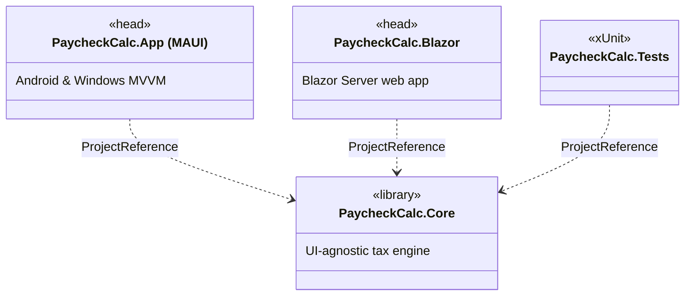
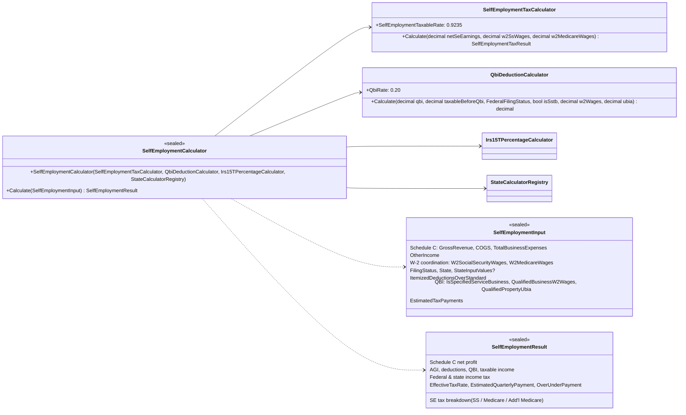
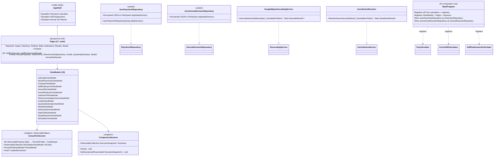
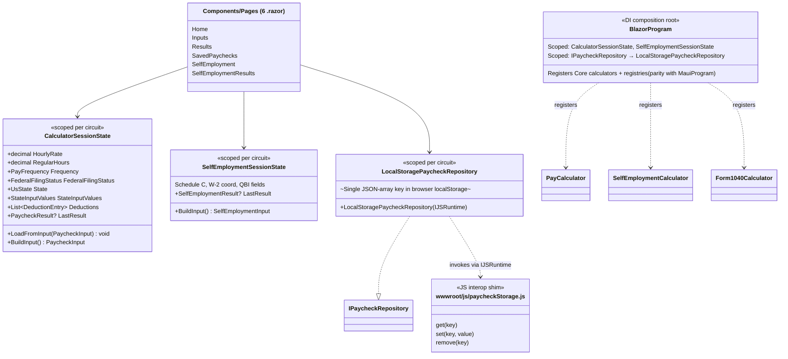

# UML Class Diagram

> High-level Mermaid class diagram for the **PaycheckCalc** solution.
> Render with any Mermaid-compatible viewer (GitHub markdown, VS Code extension, etc.).
>
> The diagram below is intentionally architectural rather than exhaustive: each
> per-state withholding calculator (50 states + DC) and each per-locality
> calculator implements the registry-driven interfaces shown here, so they are
> elided in favor of the contracts and registries that wire them together.

## Package overview

## Core — paycheck pipeline

```mermaid
classDiagram
    direction TB

    %% ── Domain models ───────────────────────────────────────
    class PaycheckInput {
        <<sealed>>
        +PayFrequency Frequency
        +decimal HourlyRate
        +decimal RegularHours
        +decimal OvertimeHours
        +decimal OvertimeMultiplier
        +UsState State
        +StateInputValues? StateInputValues
        +string? HomeLocalityCode
        +string? WorkLocalityCode
        +LocalInputValues? LocalInputValues
        +FederalW4Input FederalW4
        +IReadOnlyList~Deduction~ Deductions
        +int PaycheckNumber
    }

    class PaycheckResult {
        <<sealed>>
        +decimal GrossPay
        +decimal PreTaxDeductions
        +decimal PostTaxDeductions
        +decimal FederalTaxableIncome
        +decimal FederalWithholding
        +decimal SocialSecurityWithholding
        +decimal MedicareWithholding
        +decimal AdditionalMedicareWithholding
        +UsState State
        +decimal StateTaxableWages
        +decimal StateWithholding
        +decimal StateDisabilityInsurance
        +decimal LocalWithholding
        +decimal LocalHeadTax
        +IReadOnlyList~LocalBreakdownLine~ LocalBreakdown
        +decimal NetPay
        +decimal TotalTaxes
    }

    class FederalW4Input {
        +FederalFilingStatus FilingStatus
        +bool Step2Checked
        +decimal Step3TaxCredits
        +decimal Step4aOtherIncome
        +decimal Step4bDeductions
        +decimal Step4cExtraWithholding
    }

    class Deduction {
        +string Name
        +DeductionType Type
        +DeductionAmountType AmountType
        +decimal Amount
        +bool ReducesStateTaxableWages
        +bool ReducesFicaWages
    }

    %% ── Pay orchestrator ────────────────────────────────────
    class PayCalculator {
        <<sealed>>
        +PayCalculator(StateCalculatorRegistry, FicaCalculator, Irs15TPercentageCalculator, LocalCalculatorRegistry)
        +Calculate(PaycheckInput) PaycheckResult
    }

    class AnnualProjectionCalculator {
        +AnnualProjectionCalculator(Irs15TPercentageCalculator, FicaCalculator)
        +Project(PaycheckInput, PaycheckResult) AnnualProjection
    }

    %% ── Federal & FICA ──────────────────────────────────────
    class Irs15TPercentageCalculator {
        +Irs15TPercentageCalculator(string json)
        +CalculateWithholding(decimal taxableWages, PayFrequency, FederalW4Input) decimal
    }

    class FicaCalculator {
        +SocialSecurityWageBase: decimal
        +SocialSecurityRate: 0.062
        +MedicareRate: 0.0145
        +AdditionalMedicareRate: 0.009
        +Calculate(...) FicaResult
    }

    %% ── State plugin model ─────────────────────────────────
    class IStateWithholdingCalculator {
        <<interface>>
        +UsState State
        +GetInputSchema() IReadOnlyList~StateFieldDefinition~
        +Validate(StateInputValues) IReadOnlyList~string~
        +Calculate(CommonWithholdingContext, StateInputValues) StateWithholdingResult
    }

    class StateCalculatorRegistry {
        <<sealed>>
        +Register(IStateWithholdingCalculator) void
        +IsSupported(UsState) bool
        +GetCalculator(UsState) IStateWithholdingCalculator
        +SupportedStates: IReadOnlyList~UsState~
    }

    class StateImpls["Per-state calculators (50 + DC)"] {
        <<implementations>>
        AlabamaWithholdingCalculator
        ArkansasWithholdingCalculator
        CaliforniaWithholdingCalculator
        ...
        WyomingWithholdingCalculator
        NoIncomeTaxWithholdingAdapter
        PercentageMethodWithholdingAdapter
    }

    %% ── Local plugin model ─────────────────────────────────
    class ILocalWithholdingCalculator {
        <<interface>>
        +LocalityId Locality
        +GetInputSchema() IReadOnlyList~StateFieldDefinition~
        +Validate(LocalInputValues) IReadOnlyList~string~
        +Calculate(CommonLocalWithholdingContext, LocalInputValues) LocalWithholdingResult
    }

    class LocalCalculatorRegistry {
        <<sealed>>
        +Register(ILocalWithholdingCalculator) void
        +IsSupported(UsState) bool
        +TryGetCalculator(string?, out ILocalWithholdingCalculator?) bool
        +GetCalculatorsForState(UsState) IReadOnlyList~ILocalWithholdingCalculator~
    }

    class LocalImpls["Local calculators"] {
        <<implementations>>
        PaEitCalculator
        PaLstCalculator
        NycWithholdingCalculator
        OhRitaCalculator (OhioMunicipalCalculator)
        OhCcaCalculator (OhioMunicipalCalculator)
        MdCountyCalculator
    }

    PaycheckInput *-- FederalW4Input
    PaycheckInput *-- "0..*" Deduction
    PayCalculator ..> PaycheckInput
    PayCalculator ..> PaycheckResult
    PayCalculator --> StateCalculatorRegistry
    PayCalculator --> LocalCalculatorRegistry
    PayCalculator --> FicaCalculator
    PayCalculator --> Irs15TPercentageCalculator
    AnnualProjectionCalculator --> Irs15TPercentageCalculator
    AnnualProjectionCalculator --> FicaCalculator
    StateCalculatorRegistry o-- "0..*" IStateWithholdingCalculator
    StateImpls ..|> IStateWithholdingCalculator
    LocalCalculatorRegistry o-- "0..*" ILocalWithholdingCalculator
    LocalImpls ..|> ILocalWithholdingCalculator
```

## Core — annual Form 1040 module

```mermaid
classDiagram
    direction TB

    class Form1040Calculator {
        <<sealed>>
        +Form1040Calculator(Federal1040TaxCalculator, Schedule1Calculator, SelfEmploymentTaxCalculator, QbiDeductionCalculator, FicaCalculator, AnnualStateTaxCalculator)
        +Calculate(TaxYearProfile) AnnualTaxResult
    }

    class Federal1040TaxCalculator {
        +Federal1040TaxCalculator(string json)
        +TaxYear: int
        +GetStandardDeduction(FederalFilingStatus) decimal
        +CalculateTax(decimal taxableIncome, FederalFilingStatus) decimal
        +GetMarginalRate(decimal taxableIncome, FederalFilingStatus) decimal
    }

    class Schedule1Calculator {
        +Calculate(OtherIncomeInput, AdjustmentsInput) Schedule1Result
    }

    class ChildTaxCreditCalculator {
        +Calculate(ChildTaxCreditInput, FederalFilingStatus, decimal agi, decimal taxBeforeCtc) ChildTaxCreditResult
    }
    class Form8863EducationCreditsCalculator {
        +Calculate(EducationCreditsInput, FederalFilingStatus, decimal agi) EducationCreditsResult
    }
    class Form8880SaversCreditCalculator {
        +Calculate(SaversCreditInput, FederalFilingStatus, decimal agi) SaversCreditResult
    }
    class Form8960NiitCalculator {
        +Calculate(NetInvestmentIncomeInput, FederalFilingStatus, decimal agi) decimal
    }

    class AnnualStateTaxCalculator {
        +AnnualStateTaxCalculator(StateCalculatorRegistry)
        +Calculate(TaxYearProfile, decimal federalTaxAnnual) AnnualStateTaxResult
    }

    class Form1040ESCalculator {
        +Calculate(int taxYear, FederalFilingStatus, decimal currentYearProjectedTax, decimal expectedWithholding, PriorYearSafeHarborInput?) QuarterlyEstimatesResult
    }

    class WithholdingSuggestionCalculator {
        +Calculate(WithholdingSuggestionInput) WithholdingSuggestionResult
    }

    class TaxYearProfile {
        +int TaxYear
        +FederalFilingStatus FilingStatus
        +int QualifyingChildren
        +UsState ResidenceState
        +IReadOnlyList~W2JobInput~ W2Jobs
        +SelfEmploymentInput? SelfEmployment
        +OtherIncomeInput OtherIncome
        +AdjustmentsInput Adjustments
        +decimal ItemizedDeductionsOverStandard
        +CreditsInput Credits
        +OtherTaxesInput OtherTaxes
        +decimal EstimatedTaxPayments
        +PriorYearSafeHarborInput? PriorYearSafeHarbor
        +decimal AdditionalExpectedWithholding
        +StateInputValues? StateInputValues
    }

    class AnnualTaxResult {
        <<35+ init properties>>
        income build-up · deductions
        federal tax · credits
        state tax · payments
        refund or balance due
    }

    Form1040Calculator --> Federal1040TaxCalculator
    Form1040Calculator --> Schedule1Calculator
    Form1040Calculator --> ChildTaxCreditCalculator
    Form1040Calculator --> Form8863EducationCreditsCalculator
    Form1040Calculator --> Form8880SaversCreditCalculator
    Form1040Calculator --> Form8960NiitCalculator
    Form1040Calculator --> AnnualStateTaxCalculator
    Form1040Calculator ..> TaxYearProfile
    Form1040Calculator ..> AnnualTaxResult
    AnnualStateTaxCalculator --> StateCalculatorRegistry
```

## Core — self-employment module

## Core — storage, geocoding, exports

```mermaid
classDiagram
    direction TB

    class IPaycheckRepository {
        <<interface>>
        +GetAllAsync() Task~IReadOnlyList~SavedPaycheck~~
        +GetByIdAsync(Guid) Task~SavedPaycheck?~
        +SaveAsync(SavedPaycheck) Task
        +DeleteAsync(Guid) Task
    }
    class IAnnualScenarioRepository {
        <<interface>>
        +GetAllAsync() Task~IReadOnlyList~SavedAnnualScenario~~
        +GetByIdAsync(Guid) Task~SavedAnnualScenario?~
        +SaveAsync(SavedAnnualScenario) Task
        +DeleteAsync(Guid) Task
    }
    class SavedPaycheck {
        +Guid Id
        +string Name
        +DateTimeOffset CreatedAt
        +DateTimeOffset UpdatedAt
        +PaycheckInput Input
        +PaycheckResult Result
    }
    class SavedAnnualScenario {
        +Guid Id
        +string Name
        +DateTimeOffset CreatedAt
        +DateTimeOffset UpdatedAt
        +TaxYearProfile Profile
        +AnnualTaxResult? Result
    }

    class IGeocodingService {
        <<interface>>
        +GeocodeAsync(AddressInput, CancellationToken) Task~GeocodeResult?~
    }
    class IJurisdictionService {
        <<interface>>
        +ResolveAsync(GeocodeResult, CancellationToken) Task~JurisdictionResult~
    }
    class IAddressService {
        <<interface>>
        +Normalize(AddressInput, out IReadOnlyList~string~ errors) AddressInput
    }
    class IGeocodingCache {
        <<interface>>
        +TryGet(string, out GeocodeResult?) bool
        +Set(string, GeocodeResult) void
    }

    class CsvPaycheckExporter {
        +Generate(PaycheckResult) string
    }
    class PdfPaycheckExporter {
        +Generate(PaycheckResult) byte[]
    }
    class CsvSelfEmploymentExporter {
        +Generate(SelfEmploymentResult) string
    }
    class PdfSelfEmploymentExporter {
        +Generate(SelfEmploymentResult) byte[]
    }

    IPaycheckRepository ..> SavedPaycheck
    IAnnualScenarioRepository ..> SavedAnnualScenario
```

## MAUI head

## Blazor head

## Reading the diagrams together

- **Both heads share the same Core engine**: every calculator, registry, and
  domain model under `PaycheckCalc.Core/Tax`, `Pay`, `Models`, and `Storage` is
  consumed identically by `MauiProgram` and `Program.cs` (Blazor). The two heads
  only diverge on *presentation* (XAML vs. Razor) and *persistence implementations*
  (JSON files vs. browser `localStorage`).
- **Plugin registries are the extension points**: adding a new state means
  shipping one `IStateWithholdingCalculator` and registering it in both program
  composition roots; adding a new locality means one `ILocalWithholdingCalculator`.
  Neither change touches `PayCalculator` or any UI page.
- **Sessions are the bridge between pages**: in MAUI, `AnnualTaxSession` and
  `ComparisonSession` are singleton view-models that the 17 pages share to keep
  multi-page flows coherent. In Blazor, the equivalent role is filled by scoped
  per-circuit services (`CalculatorSessionState`, `SelfEmploymentSessionState`).
